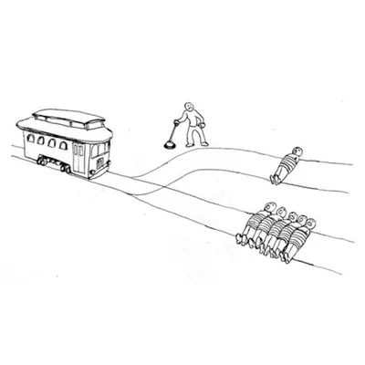
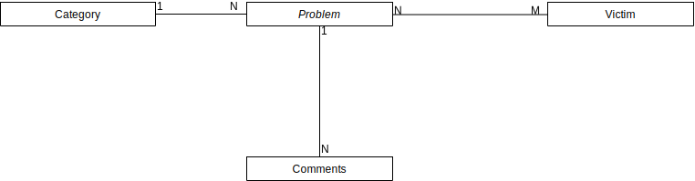

# webeC - Graded Exercise

## Project

### Team members

- [Livio Brunner](mailto:livio.brunner@students.fhnw.ch)

### Description


My idea is to write a web application
about the “Trolley Problem” meme, where users can set up their own morally difficult scenarios.



There are the following entities:



This web application consists of the following pages:

- **Homepage**: Overview of all categories which lead
to the problem details of that category. It also
has a button to create a new Problem
- **Problem Creator**: A form to create a new problem
with a live preview
- **Problem Detail**: A detail view of a problem
that is visualized graphically. It has two
buttons; "Pull the lever" or "Do nothing". Clicking
either of these button will open a summary of other
voters, the comment section and a button to go to
the next Problem

### Individual

- JavaScript Frontend with Svelte

## Installation and run instructions

- Install NodeJS (v20.12.0)
- Install [pnpm](https://pnpm.io/installation)

- Install the frontend dependencies:

```bash
cd client
pnpm i
```

### Run application

```bash
cd client
pnpm build:prod
cd ../server
./gradlew bootRun
```

### Interaction guide

> NOTE: When testing the application, your interactions
get saved into a session. This is done, so that even as
anonymous user, we won't show the same "Trolley Problem"
twice. In addition, if you comment for the first time,
the author name will get saved
into the session and you can't change it afterwards.
In order to reset, just delete the Session Cookie &
reload the page

### Run tests

```
./gradlew test
```
